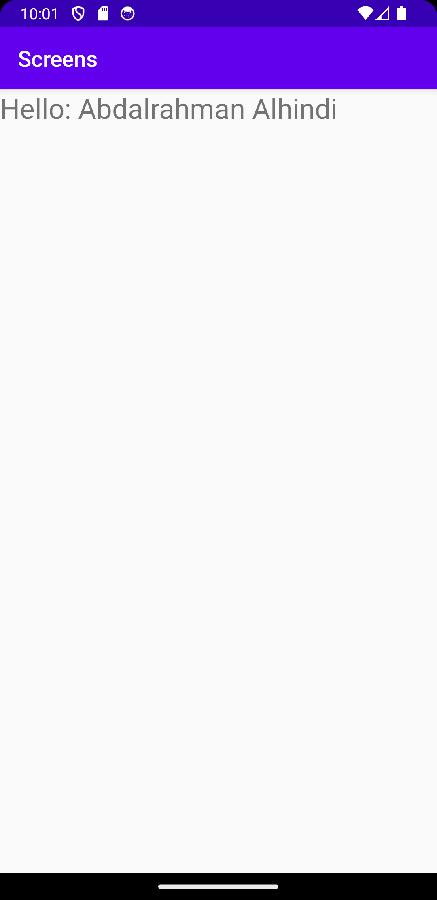

# Rapport

##Assignment4

I denna uppgift har jag lärt mig om att skapa andra *Activities* med en *Layout* och en *Java* script.
Samt har jag födjupit mig i *OnClick* funktion och *Listeners* med hjälp av java.

Filler som ändrades var MainActivity.java, AndroidMainfest.xml och activity_main.xml.
Filler som skapades är _SecondActivity.java_ och _second_activity.xml_.

MainActivity.java
```
startBtn= (Button) findViewById(R.id.startBtn);

        startBtn.setOnClickListener(new View.OnClickListener() {
            @Override
            public void onClick(View view) {
                Intent intent = new Intent(MainActivity.this, SecondActivity.class);
                intent.putExtra("Name", "Abdalrahman Alhindi");
                startActivity(intent);
            }
        });
```
activity_main.xml
```
    <Button
        android:id="@+id/startBtn"
        android:layout_width="match_parent"
        android:layout_height="wrap_content"
        android:layout_margin="80dp"
        android:textSize="24sp"
        android:text="Start"
        android:background="@color/colorPrimary"
        android:textColor="@color/colorAccent" />
```

AndroidManifest.xml
```
   <activity android:name=".SecondActivity">
            <intent-filter>
                <action android:name="android.intent.action.SECOND" />

                <category android:name="android.intent.category.LAUNCHER" />
            </intent-filter>
        </activity>
```

SecondActivity.java
```
   TextView msg = (TextView) findViewById(R.id.text);
        Bundle extras = getIntent().getExtras();
        if (extras != null) {
            String name = extras.getString("Name");
            msg.setText("Hello: " + name);
        }
```

Bilder läggs i samma mapp som markdown-filen.



